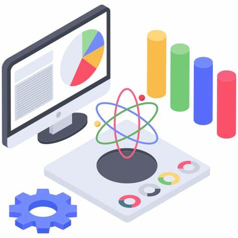

<!DOCTYPE html>
<html lang="en">
<head>
    <meta charset="UTF-8">
    <meta name="viewport" content="width=device-width, initial-scale=1.0">
    <title>LearnHub - Online Learning Platform</title>
    
</head>
<body>
    <header>
        

          <!--  -->
          
Learn Hub

        

        
☰

        <nav class="mobile-nav">
          <ul>
            <li><a href="#home"><svg xmlns="http://www.w3.org/2000/svg" viewBox="0 0 24 24"><path d="M10 20v-6h4v6h5v-8h3L12 3 2 12h3v8z"/></svg>Home</a></li>
            <li><a href="Explore.html"><svg xmlns="http://www.w3.org/2000/svg" viewBox="0 0 24 24"><path d="M12 2a10 10 0 1010 10A10 10 0 0012 2zm1 17.93V13h4.64A8 8 0 0113 19.93zM11 19.93A8 8 0 016.36 13H11zm6.64-11H13V4.07A8 8 0 0117.64 8.93zM11 4.07V9H6.36A8 8 0 0111 4.07z"/></svg>Explore</a></li>
            <li><a href="learning.html"><svg xmlns="http://www.w3.org/2000/svg" viewBox="0 0 24 24"><path d="M22 2H2v2h20zm0 4H2v2h20zm0 4H2v8h6v2h8v-2h6zM9 18v-4h6v4z"/></svg>Courses</a></li>
            <li><a href="#profile"><svg xmlns="http://www.w3.org/2000/svg" viewBox="0 0 24 24"><path d="M12 12a5 5 0 10-5-5 5 5 0 005 5zm0 2c-5.33 0-8 2.67-8 4v2h16v-2c0-1.33-2.67-4-8-4z"/></svg>Profile</a></li>
          </ul>
        </nav>
        <nav class="desktop-nav">
          <a href="#home"><svg xmlns="http://www.w3.org/2000/svg" viewBox="0 0 24 24"><path d="M10 20v-6h4v6h5v-8h3L12 3 2 12h3v8z"/></svg>Home</a>
          <a href="Explore.html"><svg xmlns="http://www.w3.org/2000/svg" viewBox="0 0 24 24"><path d="M12 2a10 10 0 1010 10A10 10 0 0012 2zm1 17.93V13h4.64A8 8 0 0113 19.93zM11 19.93A8 8 0 016.36 13H11zm6.64-11H13V4.07A8 8 0 0117.64 8.93zM11 4.07V9H6.36A8 8 0 0111 4.07z"/></svg>Explore</a>
          <a href="learning.html"><svg xmlns="http://www.w3.org/2000/svg" viewBox="0 0 24 24"><path d="M22 2H2v2h20zm0 4H2v2h20zm0 4H2v8h6v2h8v-2h6zM9 18v-4h6v4z"/></svg>Courses</a>
          <a href="#profile"><svg xmlns="http://www.w3.org/2000/svg" viewBox="0 0 24 24"><path d="M12 12a5 5 0 10-5-5 5 5 0 005 5zm0 2c-5.33 0-8 2.67-8 4v2h16v-2c0-1.33-2.67-4-8-4z"/></svg>Profile</a>
        </nav>
      </header>
    
    <section class="hero">
        

            <h1>Learn the skills you need for your future</h1>
            <h2>Unlock a world of knowledge with expert-led courses</h2>
        

        

            
        

    </section>
    
        
    <!-- Categories Start -->

    

        

            <h1 class="section-title bg-white text-center px-1 move-up">Categories</h1>
                <h1 class="mb-5 move-up move-up-delay" style="color: #2C7D89;">Popular Courses to Explore</h1>
        

        

        
            

                

                    
                    <h5 class="my-2">
                        <a href="Courses/Data-Science.html" style="text-decoration: none; color: inherit;">Data Science</a>
                    </h5>
                

            

            

                

                    
                    <h5 class="my-2">
                        <a href="Courses/Artificial-Intelligence.html" style="text-decoration: none; color: inherit;">Artificial Intelligence</a>
                    </h5>
                

            

            

                

                    
                    <h5 class="my-2">
                        <a href="Courses/Machine-Learning.html" style="text-decoration: none; color: inherit;">Machine Learning</a>
                    </h5>
                

            

          
         
            

                

                    
                    <h5 class="my-2">
                        <a href="Courses/Cybersecurity.html" style="text-decoration: none; color: inherit;">Cyber security</a>
                    </h5>
                

        

    

<!-- Categories End -->

        

            

                

                    
                

            

        

    

    <!-- Footer -->
    

        
&copy; 2025 <a href="index.html" class="text-light">LearnHub</a>. All rights reserved.

    

    
</body>
</html>

